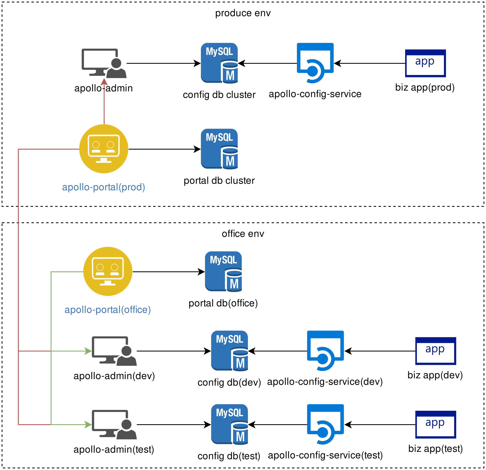

# C4.apollo
apollo config


#### 部署图




| name                        | 说明                            | 依赖      | 特殊说明                                         |
| --------------------------- | ------------------------------- | --------- | ------------------------------------------------ |
| appollo-portal(prod)        | 生产环境portal                  | portal db | 同时连接三个环境的 admin service、 protal库      |
| portal-db-cluster(prod)     | 生产环境portal数据库            | 无        |                                                  |
| apollo-admin(prod)          | 生产环境apollo管理服务          | config db | config库                                         |
| config-db-cluster(prod)     | 生产环境config数据库            | 无        |                                                  |
| apollo-config-service(prod) | 生产环境配置服务、及meta server | config db |                                                  |
| appollo-portal(office)      | 办公环境portal                  | portal db | 同时连接dev、test环境的 admin service、 protal库 |
| portal-db(office)           | 办公网portal数据库              | 无        |                                                  |
| apollo-admin(dev)           | 开发环境apollo管理服务          | config db | config库                                         |
| config-db-cluster(dev)      | 开发环境config数据库            | 无        |                                                  |
| apollo-config-service(dev)  | 开发环境配置服务、及meta server | config db |                                                  |
| apollo-admin(test)          | 测试环境apollo管理服务          | config db | config库                                         |
| config-db-cluster(test)     | 测试环境config数据库            | 无        |                                                  |
| apollo-config-service(test) | 测试环境配置服务、及meta server | config db |                                                  |

#### just do it

```bash
#docker first
docker pull mysql:5.7

mkdir -p /home/mysql/data

docker run --name mysql --restart=always -p 3306:3306 -v /home/mysql/data:/var/lib/mysql -e MYSQL_ROOT_PASSWORD=Dcjet@88 -d mysql:5.7

docker exec -it mysql /bin/bash
mysql -u root -p
```

```mysql
CREATE USER 'apollo_dev'@'%' IDENTIFIED BY 'Dcjet@88';
CREATE USER 'apollo_test'@'%' IDENTIFIED BY 'Dcjet@88';

create database apollo_config_dev DEFAULT CHARACTER SET = utf8mb4;
create database apollo_config_test DEFAULT CHARACTER SET = utf8mb4;
create database apollo_portal_office DEFAULT CHARACTER SET = utf8mb4; 

grant all privileges on apollo_config_dev.* to apollo_dev identified by 'Dcjet@88';
grant all privileges on apollo_config_test.* to apollo_test identified by 'Dcjet@88';
grant all privileges on apollo_portal_office.* to apollo_dev identified by 'Dcjet@88';

flush privileges;
exit

```

执行不同数据库的初始化脚本 [portal_office.sql](./docs/portal_office.sql)  [config.sql](./docs/config.sql)

```bash
#now login office servers
mkdir -p /home/apollo
cd /home/apollo

wget https://github.com/ctripcorp/apollo/releases/download/v1.4.0/apollo-adminservice-1.4.0-github.zip
wget https://github.com/ctripcorp/apollo/releases/download/v1.4.0/apollo-configservice-1.4.0-github.zip
wget https://github.com/ctripcorp/apollo/releases/download/v1.4.0/apollo-portal-1.4.0-github.zip


```


