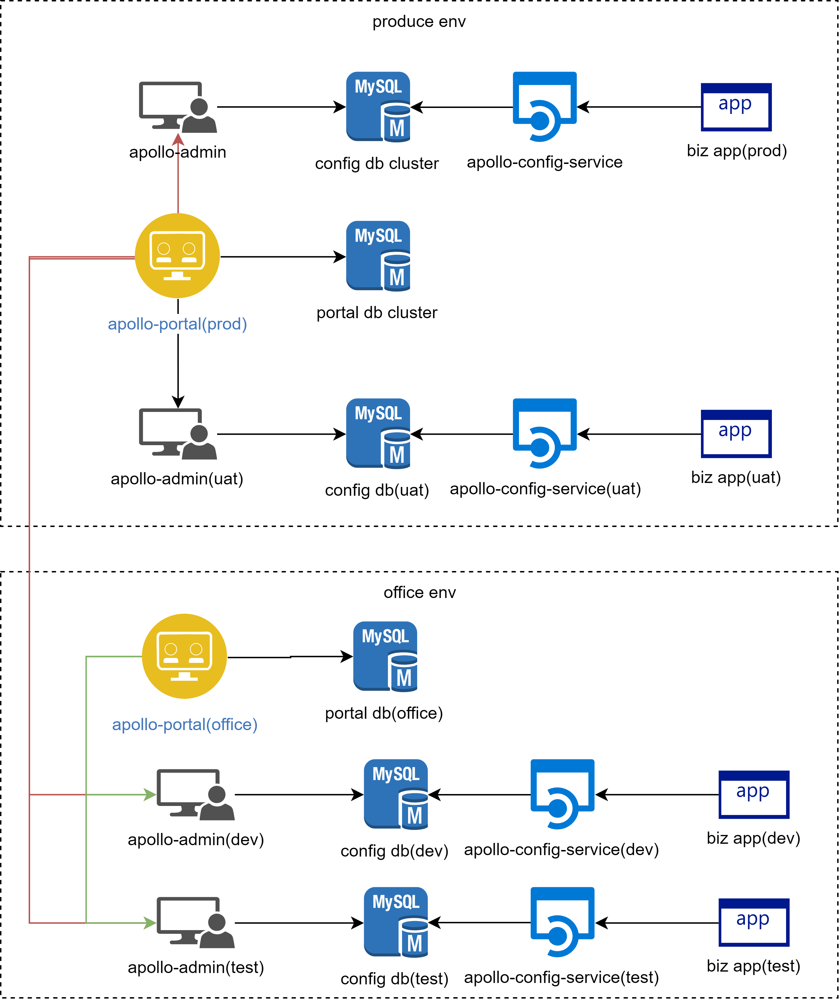

# C4.apollo
apollo config


#### 部署图




| name                        | 说明                            | 依赖      | 特殊说明                                                     |
| --------------------------- | ------------------------------- | --------- | ------------------------------------------------------------ |
| appollo-portal(prod)        | 生产环境portal                  | portal db | 同时连接三个环境的 admin service、 protal库<br />ServiceName： prod-apollo-portal<br />port:52011 |
| portal-db-cluster(prod)     | 生产环境portal数据库            | 无        |                                                              |
| apollo-admin(prod)          | 生产环境apollo管理服务          | config db | config库<br />ServiceName: prod-apollo-admin<br />port:52012 |
| config-db-cluster(prod)     | 生产环境config数据库            | 无        |                                                              |
| apollo-config-service(prod) | 生产环境配置服务、及meta server | config db | ServiceName: prod-apollo-config<br />port:52013              |
| appollo-portal(office)      | 办公环境portal                  | portal db | 同时连接dev、test环境的 admin service、 protal库<br />ServiceName： office-apollo-portal<br />port:52011 |
| portal-db(office)           | 办公网portal数据库              | 无        |                                                              |
| apollo-admin(dev)           | 开发环境apollo管理服务          | config db | config库<br />ServiceName: dev-apollo-admin<br />port:52012  |
| config-db-cluster(dev)      | 开发环境config数据库            | 无        |                                                              |
| apollo-config-service(dev)  | 开发环境配置服务、及meta server | config db | ServiceName: dev-apollo-config<br />port:52013               |
| apollo-admin(test)          | 测试环境apollo管理服务          | config db | config库<br />ServiceName: test-apollo-admin<br />port:52014 |
| config-db-cluster(test)     | 测试环境config数据库            | 无        |                                                              |
| apollo-config-service(test) | 测试环境配置服务、及meta server | config db | ServiceName: test-apollo-config<br />port:52015              |

#### just do it  开发测试环境

```bash
#docker first
docker pull mysql:5.7

mkdir -p /home/mysql/data

docker run --name mysql --restart=always -p 3306:3306 -v /home/mysql/data:/var/lib/mysql -e MYSQL_ROOT_PASSWORD=Dcjet@88 -d mysql:5.7

docker exec -it mysql /bin/bash
mysql -u root -p
```

```mysql
CREATE USER 'apollo_dev'@'%' IDENTIFIED BY 'Dcjet@88';
CREATE USER 'apollo_test'@'%' IDENTIFIED BY 'Dcjet@88';

create database apollo_config_dev DEFAULT CHARACTER SET = utf8mb4;
create database apollo_config_test DEFAULT CHARACTER SET = utf8mb4;
create database apollo_portal_office DEFAULT CHARACTER SET = utf8mb4; 

grant all privileges on apollo_config_dev.* to apollo_dev identified by 'Dcjet@88';
grant all privileges on apollo_config_test.* to apollo_test identified by 'Dcjet@88';
grant all privileges on apollo_portal_office.* to apollo_dev identified by 'Dcjet@88';

flush privileges;
exit

```

执行不同数据库的初始化脚本 [portal_office.sql](./docs/portal_office.sql)  [config_dev.sql](./docs/config_dev.sql) [config_test.sql](./docs/config_test.sql)

ps： config_*.sql 中  eureka.service.url 根据实际端口号配置

```bash
#now login office servers
mkdir -p /home/apollo
cd /home/apollo

wget https://github.com/ctripcorp/apollo/releases/download/v1.4.0/apollo-adminservice-1.4.0-github.zip
wget https://github.com/ctripcorp/apollo/releases/download/v1.4.0/apollo-configservice-1.4.0-github.zip
wget https://github.com/ctripcorp/apollo/releases/download/v1.4.0/apollo-portal-1.4.0-github.zip

unzip apollo-adminservice-1.4.0-github.zip -d dev_admin
unzip apollo-configservice-1.4.0-github.zip -d dev_config
unzip apollo-adminservice-1.4.0-github.zip -d test_admin
unzip apollo-configservice-1.4.0-github.zip -d test_config
unzip apollo-portal-1.4.0-github.zip -d office_portal

#修改数据库配置
vim dev_config/config/application-github.properties
vim dev_admin/config/application-github.properties

vim test_config/config/application-github.properties
vim test_admin/config/application-github.properties

vim office_portal/config/application-github.properties

#修改服务名及 端口号

## office portal
sed -i 's/appId=100003173/appId=200003173/g' office_portal/config/app.properties
sed -i 's?jdbc:mysql://fill-in-the-correct-server:3306/ApolloPortalDB?jdbc:mysql://192.168.12.231:3306/apollo_portal_office?g' office_portal/config/application-github.properties

sed -i 's?FillInCorrectUser?apollo_dev?g' office_portal/config/application-github.properties

sed -i 's?FillInCorrectPassword?Dcjet@88?g' office_portal/config/application-github.properties

sed -i 's/100003173/200003173/g' office_portal/apollo-portal.conf office_portal/scripts/startup.sh


sed -i 's/SERVER_PORT=8070/SERVER_PORT=52011/g' office_portal/scripts/startup.sh

##dev-admin
sed -i 's/100003172/200003172/g' dev_admin/config/app.properties dev_admin/apollo-adminservice.conf dev_admin/scripts/startup.sh

sed -i 's?jdbc:mysql://fill-in-the-correct-server:3306/ApolloConfigDB?jdbc:mysql://192.168.12.231:3306/apollo_config_dev?g' dev_admin/config/application-github.properties

sed -i 's?FillInCorrectUser?apollo_dev?g' dev_admin/config/application-github.properties

sed -i 's?FillInCorrectPassword?Dcjet@88?g' dev_admin/config/application-github.properties

sed -i 's/SERVER_PORT=8090/SERVER_PORT=52012/g' dev_admin/scripts/startup.sh

##dev-config
sed -i 's/100003171/200003171/g' dev_config/config/app.properties dev_config/apollo-configservice.conf dev_config/scripts/startup.sh

sed -i 's?jdbc:mysql://fill-in-the-correct-server:3306/ApolloConfigDB?jdbc:mysql://192.168.12.231:3306/apollo_config_dev?g' dev_config/config/application-github.properties

sed -i 's?FillInCorrectUser?apollo_dev?g' dev_config/config/application-github.properties

sed -i 's?FillInCorrectPassword?Dcjet@88?g' dev_config/config/application-github.properties

sed -i 's/SERVER_PORT=8080/SERVER_PORT=52013/g' dev_config/scripts/startup.sh


##test-admin
sed -i 's/100003172/300003172/g' test_admin/config/app.properties test_admin/apollo-adminservice.conf test_admin/scripts/startup.sh

sed -i 's?jdbc:mysql://fill-in-the-correct-server:3306/ApolloConfigDB?jdbc:mysql://192.168.12.231:3306/apollo_config_test?g' test_admin/config/application-github.properties

sed -i 's?FillInCorrectUser?apollo_test?g' test_admin/config/application-github.properties

sed -i 's?FillInCorrectPassword?Dcjet@88?g' test_admin/config/application-github.properties

sed -i 's/SERVER_PORT=8090/SERVER_PORT=52014/g' test_admin/scripts/startup.sh

##test-config
sed -i 's/100003171/300003171/g' test_config/config/app.properties test_config/apollo-configservice.conf test_config/scripts/startup.sh

sed -i 's?jdbc:mysql://fill-in-the-correct-server:3306/ApolloConfigDB?jdbc:mysql://192.168.12.231:3306/apollo_config_test?g' test_config/config/application-github.properties

sed -i 's?FillInCorrectUser?apollo_test?g' test_config/config/application-github.properties

sed -i 's?FillInCorrectPassword?Dcjet@88?g' test_config/config/application-github.properties

sed -i 's/SERVER_PORT=8080/SERVER_PORT=52015/g' test_config/scripts/startup.sh


## 	配置apollo-portal的meta service信息
#dev :  xxx : 52013
#fat :  xxx : 52015
vim office_portal/config/apollo-env.properties
#如：
```

```properties
#local.meta=http://localhost:8080
dev.meta=http://192.168.12.231:52013
fat.meta=http://192.168.12.231:52015
#uat.meta=http://fill-in-uat-meta-server:8080
#lpt.meta=${lpt_meta}
#pro.meta=http://fill-in-pro-meta-server:8080

```

### 特殊配置

portal 中根据实际配置jvm参数：startup.sh中添加

```properties
export JAVA_OPTS="-server -Xms4096m -Xmx4096m -Xss256k -XX:MetaspaceSize=128m -XX:MaxMetaspaceSize=384m -XX:NewSize=1536m -XX:MaxNewSize=1536m -XX:SurvivorRatio=22"
```

#### 启动

```bash
/home/apollo/office_portal/scripts/startup.sh
/home/apollo/dev_config/scripts/startup.sh
/home/apollo/dev_admin/scripts/startup.sh
/home/apollo/test_config/scripts/startup.sh
/home/apollo/test_admin/scripts/startup.sh
```

#### 开机自启

```bash
chmod +x /etc/rc.d/rc.local
vim /etc/rc.d/rc.local
```


## 可被外部访问

需要在开发环境和测试环境中 startup.sh 添加已下jvm配置信息，然后重启

```sh
# vim /home/apollo/dev_config/scripts/startup.sh
-Deureka.instance.homePageUrl=http://devops.dcjet.com.cn:52000/apolloDev 
# vim /home/apollo/dev_admin/scripts/startup.sh
-Deureka.instance.homePageUrl=http://devops.dcjet.com.cn:52000/apolloDevAdmin
# vim /home/apollo/test_config/scripts/startup.sh
-Deureka.instance.homePageUrl=http://devops.dcjet.com.cn:52000/apolloTest 
# vim /home/apollo/test_admin/scripts/startup.sh
-Deureka.instance.homePageUrl=http://devops.dcjet.com.cn:52000/apolloTestAdmin

#重启
```

登录 xxx.xxx.xxx.xxxx:52011

apollo/admin

在系统信息中查看所有节点


## just do it  uat环境


## just do it 生产环境

```bash
#创建数据库
CREATE USER 'apollo_prod'@'%' IDENTIFIED BY 'Dcjet@88';
create database apollo_config_prod DEFAULT CHARACTER SET = utf8mb4;
create database apollo_portal_prod DEFAULT CHARACTER SET = utf8mb4; 

grant all privileges on apollo_config_prod.* to apollo_prod identified by 'Dcjet@88';
grant all privileges on apollo_portal_prod.* to apollo_prod identified by 'Dcjet@88';

flush privileges;
exit
```

执行不同数据库的初始化脚本 [portal_prod.sql](./docs/portal_prod.sql)  [config_prod.sql](./docs/config_prod.sql) 

ps:需要根据实际高可用情况配置apollo_config_prod 中的ServerConfig 中的eureka.service.url

#### 多台服务器部署应用 其中只有 config需要多机部署

```bash
#now login office servers
mkdir -p /home/apollo
cd /home/apollo

wget https://github.com/ctripcorp/apollo/releases/download/v1.4.0/apollo-adminservice-1.4.0-github.zip
wget https://github.com/ctripcorp/apollo/releases/download/v1.4.0/apollo-configservice-1.4.0-github.zip
wget https://github.com/ctripcorp/apollo/releases/download/v1.4.0/apollo-portal-1.4.0-github.zip

unzip apollo-adminservice-1.4.0-github.zip -d prod_admin
unzip apollo-configservice-1.4.0-github.zip -d prod_config
unzip apollo-portal-1.4.0-github.zip -d prod_portal

## portal
sed -i 's?jdbc:mysql://fill-in-the-correct-server:3306/ApolloPortalDB?jdbc:mysql://192.168.108.200:3306/apollo_portal_prod?g' prod_portal/config/application-github.properties

sed -i 's?FillInCorrectUser?apollo_prod?g' prod_portal/config/application-github.properties

sed -i 's?FillInCorrectPassword?Dcjet@88?g' prod_portal/config/application-github.properties

sed -i 's/100003173/200003173/g' prod_portal/apollo-portal.conf prod_portal/scripts/startup.sh prod_portal/config/app.properties

sed -i 's/SERVER_PORT=8070/SERVER_PORT=52011/g' prod_portal/scripts/startup.sh

##prod-admin
sed -i 's/100003172/200003172/g' prod_admin/config/app.properties prod_admin/apollo-adminservice.conf prod_admin/scripts/startup.sh

sed -i 's?jdbc:mysql://fill-in-the-correct-server:3306/ApolloConfigDB?jdbc:mysql://192.168.108.200:3306/apollo_config_prod?g' prod_admin/config/application-github.properties

sed -i 's?FillInCorrectUser?apollo_prod?g' prod_admin/config/application-github.properties

sed -i 's?FillInCorrectPassword?Dcjet@88?g' prod_admin/config/application-github.properties

sed -i 's/SERVER_PORT=8090/SERVER_PORT=52012/g' prod_admin/scripts/startup.sh

##prod-config
sed -i 's/100003171/200003171/g' prod_config/config/app.properties prod_config/apollo-configservice.conf prod_config/scripts/startup.sh

sed -i 's?jdbc:mysql://fill-in-the-correct-server:3306/ApolloConfigDB?jdbc:mysql://192.168.108.200:3306/apollo_config_prod?g' prod_config/config/application-github.properties

sed -i 's?FillInCorrectUser?apollo_prod?g' prod_config/config/application-github.properties

sed -i 's?FillInCorrectPassword?Dcjet@88?g' prod_config/config/application-github.properties

sed -i 's/SERVER_PORT=8080/SERVER_PORT=52013/g' prod_config/scripts/startup.sh

## 	配置apollo-portal的meta service信息
#dev :  xxx : 52013
#fat :  xxx : 52015
vim prod_portal/config/apollo-env.properties
#如：
```

```properties
#local.meta=http://localhost:8080
dev.meta=http://192.168.12.231:52013    #开发环境的实际地址
fat.meta=http://192.168.12.231:52015    #开发环境的外网地址
#uat.meta=http://fill-in-uat-meta-server:8080
#lpt.meta=${lpt_meta}
pro.meta=http://192.168.108.200:52013,http://192.168.108.201:52013
```

### 启动

```bash
/home/apollo/prod_portal/scripts/startup.sh
/home/apollo/prod_config/scripts/startup.sh
/home/apollo/prod_admin/scripts/startup.sh
```


## client接入

[java](./java.md)


## apollo 管理

[管理](./manage.md)